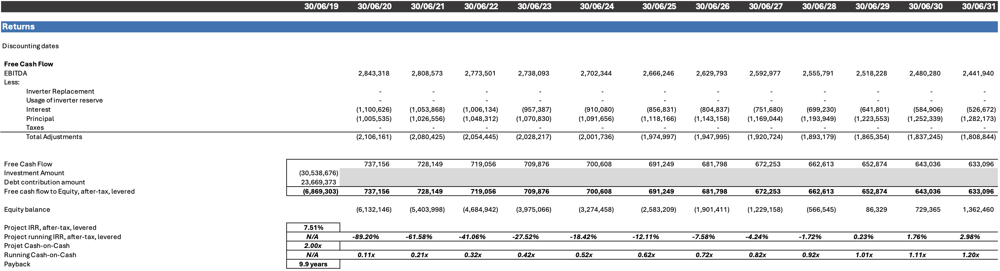

# Solar Financial Modeling

With a solid foundation in energy systems developed during my mechanical engineering studies, my passion for renewable energy projects has grown stronger over time. A significant project in my final year, titled “Sizing of PV-Wind Hybrid System with Two Different Optimization Objectives,” involved optimizing a hybrid energy system to minimize both the Levelized Cost of Energy (LCOE) and weighted-average LCOE. This experience provided me with valuable insights into energy technologies and the complexities of assessing their financial viability.

Now, as I pursue my Master’s in Management at TUM with a focus on finance, I’m eager to combine my technical knowledge with my growing business expertise. Through this self-initiated case study, I am continuing to develop my skills in financial modeling and strategic decision-making, which are essential for my long-term goals.

## Table of contents
1. [Introduction](#introduction)
2. [Project Assumptions](#project-assumptions)
   1. [Technical Overview](#technical-overview)
   2. [Challenges and Key Considerations](#challenges-and-key-considerations)
   3. [Power Production](#power-production)
   4. [Power Purchase Agreement (PPA) Summary](#power-purchase-agreement-ppa-summary)
   5. [Construction Cost Summary](#construction-cost-summary)
   6. [Financing Summary](#financing-summary)
   7. [Tax Rates](#tax-rates)
   8. [Operating Expenses](#operating-expenses)
3. [Financial Model](#financial-model)
   1. [Assumptions](#assumptions)
   1. [Production, Revenue, Expenses, EBITDA](#production-revenue-expenses-ebitda)
   2. [Debt Sizing](#debt-sizing)
   3. [Depreciation Balances, and Cash Taxes Payable](#depreciation-balances-and-cash-taxes-payable)
   4. [Returns](#returns)
   5. [Sensitivity Analysis](#sensitivity-analysis)
   6. [Charts and Graphs](#charts-and-graphs)

## Introduction
As the Analyst of Project Finance at the fictitious company Global Solar Solutions GmbH, I was recently approached by Luminis Bank, a fictitious financial institution specializing in energy projects, with an intriguing opportunity. The bank had been contacted regarding a 25 MW (DC) solar project known as Project Helios. However, there was a twist: the original developer had defaulted on their Power Purchase Agreement (PPA), forcing them to sell the project.

The project is in a nearly complete state. The developer has undertaken extensive groundwork, including:
- Completing the Phase I Environmental Site Assessment.
- Conducting geotechnical studies.
- Securing an Engineering, Procurement, and Construction (EPC) contract.
- Reaching the Notice to Proceed (NTP) stage, with only financing needed to commence construction.

At Global Solar Solutions GmbH, we have a well-defined investment strategy, with a 7.5% levered Internal Rate of Return (IRR) as our minimum threshold for new solar energy projects. The main goal of this analysis is to use the project assumptions outlined below to create an Excel model, which will build both a cash flow model and an output model to determine the price to be paid for facilitating Project Helios.

## Project Assumptions
Project Helios is a 25MW (DC) and 20MW (AC) solar energy project located in the Republic of Solara, a fictitious island nation in the southern part of Europe. The Republic of Solara has ambitious goals to become fully dependent on renewable energy by 2030, and the country has made significant progress toward this target. The national utility, Solara Energy, owns the transmission lines and has been actively procuring renewable energy for over a decade through various Request for Proposals (RFPs).

The project received a Power Purchase Agreement (PPA) from Solara Energy back in 2016, establishing the terms for energy sales during the first 20 years. The functional currency of the Republic of Solara the Euro.

### Technical Overview
- **Project Life:** The solar project has a projected operational life of 30 years.
- **Merchant Market Sales:** After the PPA term ends, the project will be able to sell energy on the merchant market, where prices are expected to range between €25/MWh and €40/MWh.
- **Panels and Warranty:** The project will utilize DayPower AAA Series 400 W panels, known for their high efficiency and reliability. DayPower offers a 25-year warranty on the panels, and the expected degradation rate is 0.5% annually.
- **Construction Timeline:** If acquired, construction is expected to be completed by December 31, 2019, with the Commercial Operation Date (COD) scheduled for January 1, 2020.

### Challenges and Key Considerations
The original developer, GreenTech Innovations GmbH, has defaulted on a critical clause in the PPA, which required the COD to occur no later than three years from the agreement’s effective date of April 30, 2016. This default has created complications that must be carefully addressed during the acquisition process.

The following documents are available for review in the project’s data room:
- **Executed EPC contract:** The EPC contract is priced at €0.99/MWdc.
- **Phase I Environmental Site Assessment (ESA)**.
- **Interconnection Submission and Work:** Conducted by Solara Energy.
- **Independent Engineering Report:** Prepared by Newton Engineering GmbH.
- **Financing Term Sheet:** Provided by Solara National Bank.

### Power Production

  <table>
    <tr>
      <th>Probability</th>
      <th>Production</th>
    </tr>
    <tr>
      <td>P50</td>
      <td>50,370.0 MWh</td>
    </tr>
    <tr>
      <td>P75</td>
      <td>49,110.0 MWh</td>
    </tr>
    <tr>
      <td>P90</td>
      <td>46,960.0 MWh</td>
    </tr>
    <tr>
      <td>P99</td>
      <td>44,073.0 MWh</td>
    </tr>
  </table>

### Power Purchase Agreement (PPA) Summary

  <table>
    <tr>
      <th>Offtaker</th>
      <th>PPA Term</th>
      <th>Project Size</th>
      <th>PPA Price</th>
      <th>Liquidated Damages</th>
    </tr>
    <tr>
      <td>Solara Energy</td>
      <td>20 years</td>
      <td>25.0 MW (DC) / 20.0 MW (AC)</td>
      <td>€72.50 / MWh</td>
      <td>€-</td>
    </tr>
  </table>

### Construction Cost Summary

  <table>
    <tr>
      <th>Description</th>
      <th>Cost (€)</th>
      <th>€/W (DC)</th>
      <th>€/W (AC)</th>
    </tr>
    <tr>
      <td>EPC Contract</td>
      <td>24,675,000</td>
      <td>0.99</td>
      <td>1.23</td>
    </tr>
    <tr>
      <td>Land</td>
      <td>-</td>
      <td>-</td>
      <td>-</td>
    </tr>
    <tr>
      <td>Other Costs</td>
      <td>780,000</td>
      <td>0.03</td>
      <td>0.04</td>
    </tr>
    <tr>
      <td>Interconnection Costs</td>
      <td>1,350,000</td>
      <td>0.05</td>
      <td>0.07</td>
    </tr>
    <tr>
      <td>Contingency</td>
      <td>1,500,000</td>
      <td>0.04</td>
      <td>0.08</td>
    </tr>
    <tr>
      <td>Transaction Costs</td>
      <td>450,000</td>
      <td>0.02</td>
      <td>0.02</td>
    </tr>
    <tr>
      <td>Debt Arrangement Costs</td>
      <td>200,000</td>
      <td>0.01</td>
      <td>0.01</td>
    </tr>
    <tr>
      <td>Debt Service Reserve Account</td>
      <td>[TBD]</td>
      <td>[TBD]</td>
      <td>[TBD]</td>
    </tr>
    <tr>
      <th>Total</th>
      <th>28,955,000</th>
      <th>1.14</th>
      <th>1.45</th>
    </tr>
  </table>

### Financing Summary

  <table>
    <tr>
      <th>Title</th>
      <th>Description</th>
    </tr>
    <tr>
      <td>Term of Financing</td>
      <td>19 years</td>
    </tr>
    <tr>
      <td>Maximum Loan to Value</td>
      <td>85%</td>
    </tr>
    <tr>
      <td>DSRA</td>
      <td>6-months of principal and interest</td>
    </tr>
    <tr>
      <td>Base Rate (3-month LIBOR)</td>
      <td>240 bps</td>
    </tr>
    <tr>
      <td>Spread</td>
      <td>175 bps</td>
    </tr>
    <tr>
      <td>Swap Rate</td>
      <td>50 bps</td>
    </tr>
    <tr>
      <td>All-in Rate</td>
      <td>465 bps</td>
    </tr>
  </table>

#### Covenants
- DSCR P50: 1.35x
- DSCR P99: 1.00x

### Tax Rates

  <table>
    <tr>
      <th>Tax Class</th>
      <th>Depreciation Rate (% per year)</th>
      <th>Percentage of Capex (%)</th>
    </tr>
    <tr>
      <td>Class A</td>
      <td>5.0%</td>
      <td>0.2%</td>
    </tr>
    <tr>
      <td>Class B</td>
      <td>20.0%</td>
      <td>0.0%</td>
    </tr>
    <tr>
      <td>Class C</td>
      <td>5.0%</td>
      <td>3.2%</td>
    </tr>
    <tr>
      <td>Class D</td>
      <td>10.0%</td>
      <td>0.6%</td>
    </tr>
    <tr>
      <td>Class E</td>
      <td>25.0%</td>
      <td>92.8%</td>
    </tr>
  </table>

#### Notes
- The Republic of Solara’s depreciation rates are the rates per year charged against each class.
- Newton Engineering GmbH conduced an analysis of the construction for Project Helios and determined that the total construction cost could be distributed across each tax class according to the percentages provided in the table above.
- The Republic of Solara's tax rate is 25.0%, and cash can be repatriated to your home country tax-free.

### Operating Expenses

  <table>
    <tr>
      <th>Title</th>
      <th>Cost (€ per year)</th>
    </tr>
    <tr>
      <td>Operations and Maintenance</td>
      <td>276,000</td>
    </tr>
    <tr>
      <td>General and Administrative (G&A)</td>
      <td>75,000</td>
    </tr>
    <tr>
      <td>Insurance</td>
      <td>103,000</td>
    </tr>
    <tr>
      <td>Property Tax</td>
      <td>155,000</td>
    </tr>
    <tr>
      <td>Lease (Years 1-20)</td>
      <td>115,000</td>
    </tr>
    <tr>
      <td>Lease (Years 21-30)</td>
      <td>165,000</td>
    </tr>
    <tr>
      <td>Other</td>
      <td>28,000</td>
    </tr>
    <tr>
      <td>Inverter Reserve</td>
      <td>30,000</td>
    </tr>
    <tr>
      <td>Contingency</td>
      <td>5%</td>
    </tr>
  </table>

## Financial Model
The primary objective of the financial model is to evaluate the financial feasibility of the project and assist stakeholders in making informed decisions. The model will assess the return on investment, risks, and financial performance over the project’s lifetime. Key goals include:
- **Evaluating Financial Viability:** To ensure the project meets the financial targets, including minimum IRR and NPV thresholds.
- **Assessing Debt and Equity Structure:** To determine the appropriate balance of debt and equity financing to optimize the project’s capital structure.
- **Risk Analysis:** To identify and assess key risks associated with the project, including construction delays, regulatory changes, and energy price fluctuations.

### Assumptions

The project exhibits robust financial fundamentals, underpinned by a favorable 20-year PPA at €72.75/MWh, ensuring stable revenues and swift capital recovery. This is further bolstered by an aggressive 85% debt leverage and tax advantages from accelerated depreciation on Class E assets. The financing structure, featuring a 19-year amortization period and a fixed 4.65% interest rate, provides stability and rapid debt repayment. While the project demonstrates strong short-term resilience with P50 and P99 DSCR minimums of 1.35x and 1.00x respectively, and includes prudent measures such as a 5% contingency and a 6-month DSRA, the post-PPA period presents a significant risk with projected prices dropping to €35/MWh. To mitigate this long-term market exposure and enhance overall project value, management should prioritize securing additional long-term power contracts or implementing robust hedging strategies beyond the initial PPA term.

### Production, Revenue, Expenses, EBITDA

The financial analysis of the project indicates a strong revenue potential during the initial 20 years under the Power Purchase Agreement (PPA), with stable power prices set at €72.75/MWh and consistent production levels. Although production is expected to decline gradually by approximately 0.5% annually, EBITDA is projected to peak at €2,843,318 in the first year, tapering to €2,166,000 by the end of the PPA. A critical concern arises post-PPA, where power prices are anticipated to plummet to €35/MWh in year 21, resulting in an over 80% reduction in EBITDA during the latter years of the project's lifecycle. This financial decline will be compounded by increasing operational costs, particularly rising lease payments and a 5% contingency reserve for unforeseen risks. While the project demonstrates robust EBITDA during the PPA phase—facilitating debt repayment and investor returns—strategic planning is imperative to address the revenue challenges post-2040. Potential strategies include exploring hedging opportunities, renegotiating long-term off-take agreements, and diversifying revenue streams to sustain financial health beyond the PPA term. Overall, while the project is financially viable during its initial term, proactive measures are essential to ensure continued profitability in the long term.

### Debt Sizing

The debt sizing analysis demonstrates a well-structured repayment schedule that ensures manageable debt service obligations through 2038, with debt balances gradually decreasing over time. Throughout the forecast period, the P50 Debt Service Coverage Ratio (DSCR) remains robust at 1.35x, while the P99 DSCR starts at 1.13x and slightly declines to 1.10x by 2038. As the debt balance reduces, interest payments also decrease, aligning with the steady reduction in principal repayments. P50 EBITDA is projected to decline from €2,843,318 in 2020 to €2,166,000 by 2038, while P99 EBITDA decreases from €2,385,211 to €1,751,413 during the same timeframe. Notably, after 2038, both P50 and P99 EBITDA experience a significant drop, with P50 falling to €335,339 in 2039 and continuing to decline thereafter, while P99 EBITDA turns negative from 2044 onwards. This sharp decline in EBITDA post-2038 presents a growing risk to liquidity and debt service capacity in the later years. To mitigate these risks and ensure ongoing financial stability, the business must prioritize maintaining revenue stability, optimizing cash flow, and exploring refinancing options. Although the debt sizing aligns well with projected cash flows in the initial years, proactive strategies will be essential to navigate the anticipated challenges related to declining profitability after 2038.

### Depreciation Balances, and Cash Taxes Payable

The depreciation schedule outlines the allocation of depreciation across five asset classes (A, B, C, D, and E) over time, providing insights into their financial impact. Class A depreciates by €3,310 annually from an initial balance of €66,201, while Class B remains non-depreciable. Class C, starting at €979,506, incurs an annual depreciation of €48,975. Class D begins at €175,718 with a yearly depreciation of €17,572. Class E, the largest asset class, starts at €28,337,902 and depreciates by €7,084,476 annually for the first four years. This depreciation plays a crucial role in tax management by sheltering taxable income and enhancing the tax shield in the early years of the project. As a result, the accumulating tax shelter from depreciation leads to lower taxes payable initially. However, starting in 2029, taxes payable are projected to increase significantly as the depreciation balances decline, which may reduce the tax benefits unless offset by strategic financial planning. It is essential to consider these dynamics to optimize tax efficiency and overall financial performance throughout the project's lifecycle.

### Returns

The financial model presents a project with an initial investment of $30.54 million, predominantly financed through debt ($23.67 million) with an equity contribution of $6.87 million. In its early stages, the project experiences negative equity balances due to substantial debt repayments and high interest expenses. However, as the project matures, both debt and interest payments decrease, leading to improved free cash flows and eventually a positive equity balance. The project's internal rate of return (IRR) progressively increases to a final value of 7.51%, while the cash-on-cash multiple reaches 2.00x, indicating that each dollar invested will yield two dollars in cash over the project's lifetime. With a payback period of 9.9 years, the project transitions from financial strain in its early years to increasing profitability as debt is repaid. Notably, the model demonstrates that the project achieves its break-even point between years 9 and 10, marked by the shift from negative to positive equity balance. This financial trajectory suggests that despite initial challenges, the project ultimately generates positive returns for equity holders, showcasing its long-term viability and potential for value creation.

### Sensitivity Analysis

The sensitivity analysis demonstrates that both the Power Purchase Agreement (PPA) price and term significantly influence the project's financial performance. A higher PPA price correlates with an improved Internal Rate of Return (IRR), showing substantial enhancement as the price increases. Similarly, extending the PPA term leads to a higher IRR, as the project benefits from a prolonged revenue stream. The payback period analysis reveals that higher PPA prices reduce the time required to recoup the investment, enhancing the project's attractiveness. However, contrary to initial expectations, the post-PPA rate shows no discernible effect on the payback period in the provided data. To optimize financial viability, the analysis suggests that securing a higher PPA price and negotiating a longer PPA term are crucial strategies. While these factors demonstrate clear impacts on the project's financial metrics, the influence of the post-PPA rate remains inconclusive based on the available information, highlighting an area for potential further investigation to fully understand its long-term implications on the project's economics.

### Charts and Graphs

This section provides an overview of the metrics discussed in other parts of the model. The inclusion of financial data, along with a visual representation of the trends over the years, facilitates an easier understanding of the changes. The graph offers a practical way to track annual variations in revenue, expenses, EBITDA, cash flow, and the PPA rate, making it easier to assess the model’s future performance.

 

According to the sources and uses table and pie charts, the financing structure presents a well-balanced approach to funding the project, with a clear mix of debt and equity. The project is leveraging 77.5% debt (€23,669,373), which is a relatively high level of leverage, indicating a strong reliance on debt financing. This is common in large capital-intensive projects, as it allows the sponsor to maximize returns on equity while minimizing upfront capital outlay. The remaining 22.5% equity (€6,869,303) ensures that the investors have a stake in the project, which is important for both the project’s risk profile and potential upside.

The use of funds is appropriately allocated, with the majority (€24,675,000) directed towards the EPC contract, which is the critical component of the project’s development phase. The additional costs, including land acquisition, interconnection, transaction fees, and a contingency reserve, are all reasonable and ensure that the project is not underfunded in unforeseen scenarios. The inclusion of a debt service reserve account (€1,053,081) reflects a careful consideration of liquidity needs, ensuring that the project can meet its debt obligations even in the case of delays or cash flow fluctuations.

Overall, the capital structure appears to be well-structured for a project of this nature, offering a solid return on equity while managing risks through strategic allocation of costs and reserves. The debt-heavy financing approach will need to be closely monitored to ensure that the project’s cash flows are sufficient to meet debt servicing requirements, but the planned reserves and contingencies offer a cushion against potential challenges.
